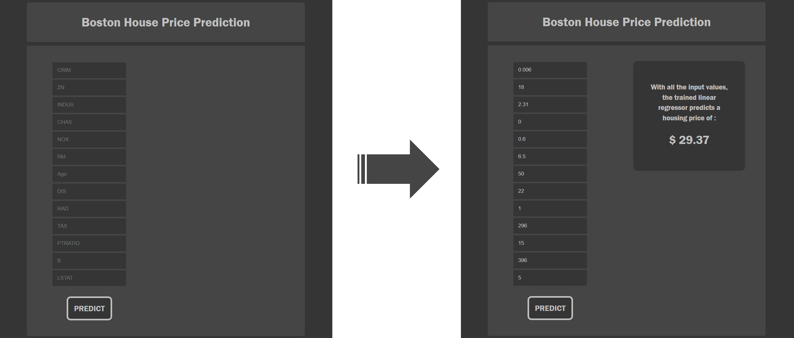

# Dockerized Flask App

Basic Flask app implementing a ML model that can predict the cost of housing per day depending on the input of the user.

The model can be used running : 
```
docker build . -t <image_name>
docker run -p 5000:5000 <image_name>
```
The app can then be tested on <code>http://127.0.0.1:5000/</code>

<br/>

<p align="center">

</p>
